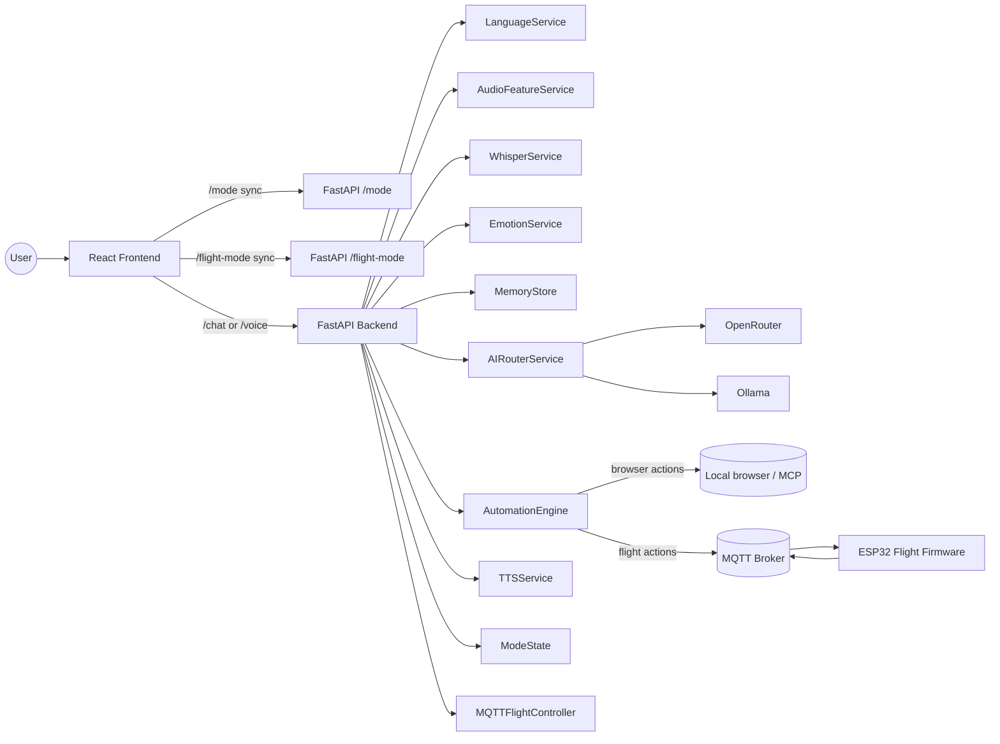

# ZARA AI

ZARA is a multi-mode voice-first AI platform built to evolve from a conversational assistant into a domain automation core. Right now the project focuses on two modes:

- Default mode: normal conversational AI with voice input, multilingual replies, memory, and safe browser/system actions.
- Flight Mode: drone automation control over MQTT for ESP32-based hardware.

The long-term architecture is intentionally reusable. Farm, home, and device automations are planned to follow the same Zara core with new domain-specific intent handlers and execution adapters.

## What ZARA Does

- Captures voice or text from the frontend.
- Detects language and user intent.
- Routes normal conversation through online, smart, or offline AI models.
- Executes safe automation such as browser actions, current time/date, and Flight Mode hardware commands.
- Returns text, emotion, audio features, and action metadata to the UI.

## Mode Model

There are two different mode layers in the codebase:

| Layer | Options | Purpose |
| --- | --- | --- |
| AI response mode | `online`, `smart`, `offline` | Chooses the language-model routing strategy for normal conversation. |
| Product mode | Default conversational mode, Flight Mode, future domain modes | Chooses which domain ZARA should operate in. |

Default conversational mode uses the AI response router. Flight Mode is a separate hardware gate that allows voice commands to be published to the flight controller only when it is enabled.

## Architecture Overview



The important idea is simple: the frontend captures input and syncs mode state, the backend decides whether a request is conversation or automation, and the executor for Flight Mode is always MQTT.

## Repository Layout

- `src/`: Vite + React + TypeScript frontend.
- `backend/`: FastAPI backend, mode state, AI routing, voice pipeline, TTS, and MQTT bridge.
- `iot/esp32/`: ESP32 Arduino firmware for Flight Mode hardware control.
- `deploy/`: production deployment files for Caddy, nginx, and Mosquitto.
- `backend/FLIGHT_MODE_MQTT.md`: detailed Flight Mode protocol and safety notes.
- `DEPLOYMENT_ONLINE.md`: VPS deployment guide.
- `DEPLOYMENT_VERCEL_RENDER.md`: Vercel + Render deployment guide.

## Core System Flow

### 1) Default Conversational Flow

1. The user speaks or types in the frontend.
2. The UI sends text to `POST /chat` or voice audio to `POST /voice`.
3. The backend detects the language, extracts audio features, and looks for a safe automation intent.
4. If no automation matches, ZARA routes the prompt through the AI response engine.
5. The backend returns the response text, language, emotion, audio features, and any action metadata.
6. The frontend displays the answer and speaks it with backend TTS or browser speech synthesis.

### 2) Flight Mode Flow

1. The user enables Flight Mode in Settings.
2. The frontend syncs the toggle to `POST /flight-mode`.
3. The backend stores that state in `ModeState`.
4. When a flight intent is detected, the automation engine maps it to a flight action such as `engine_on`, `servo_left`, or `throttle_up`.
5. If Flight Mode is off, the backend blocks the command and returns a safe explanation.
6. If Flight Mode is on, the backend publishes a JSON payload to `zara/flight/control` through MQTT.
7. The ESP32 subscribes to the control topic, executes the hardware action, and publishes status updates to `zara/flight/status`.
8. The backend exposes the broker state and latest status through `GET /flight/status`.

### 3) Voice Pipeline

1. The frontend records short microphone chunks.
2. The backend transcribes the chunk with Faster-Whisper.
3. Audio features are extracted from the raw chunk for UI reactivity.
4. Language detection combines text-based detection with Whisper hints.
5. Emotion is inferred from text sentiment and voice volume.
6. The request is routed through the automation engine and AI router.

## Backend Services

The backend is organized around small services that each do one job:

- `backend/app/main.py`: FastAPI app, route handlers, and service wiring.
- `backend/app/config.py`: environment-driven settings.
- `backend/app/schemas.py`: request and response models.
- `backend/app/services/mode_state.py`: in-memory mode and Flight Mode state.
- `backend/app/services/language_service.py`: multilingual language detection.
- `backend/app/services/audio_features.py`: lightweight audio feature extraction.
- `backend/app/services/whisper_service.py`: lazy-loaded Faster-Whisper transcription.
- `backend/app/services/emotion_service.py`: sentiment plus voice-energy emotion mapping.
- `backend/app/services/memory.py`: short conversation history.
- `backend/app/services/ai_router.py`: online, smart, and offline model routing.
- `backend/app/services/automation.py`: safe browser, system, and flight intent detection.
- `backend/app/services/mqtt_flight.py`: MQTT command publisher and status subscriber.
- `backend/app/services/tts_service.py`: optional backend TTS.
- `backend/app/services/mcp_service.py`: optional browser bridge for open-url style actions.

## Frontend Experience

The UI is intentionally voice-first:

- `src/pages/Index.tsx` orchestrates microphone capture, request sending, speaking responses, and continuous listening.
- `src/components/Orb.tsx` renders the reactive visual orb.
- `src/components/SettingsPanel.tsx` exposes AI, voice, mode, automation, memory, privacy, and advanced controls.
- `src/lib/backend.ts` is the typed API client for `/mode`, `/flight-mode`, `/chat`, `/voice`, `/tts`, and `/health`.
- `src/lib/settings.ts` stores the frontend settings model, including `responseMode`, `flightMode`, and voice behavior.

## API Reference

### Health and Mode

| Method | Path | Purpose |
| --- | --- | --- |
| `GET` | `/health` | Health check. |
| `POST` | `/mode` | Set the AI response mode to `online`, `smart`, or `offline`. |
| `POST` | `/flight-mode` | Enable or disable Flight Mode. |
| `GET` | `/flight-mode` | Read the current Flight Mode state. |
| `GET` | `/flight/status` | Read MQTT connection info and last ESP32 status. |

### AI and Voice

| Method | Path | Purpose |
| --- | --- | --- |
| `POST` | `/chat` | Text conversation endpoint. |
| `POST` | `/voice` | Audio conversation endpoint. |
| `POST` | `/tts` | Convert text to speech audio. |
| `WS` | `/ws/orb` | Real-time audio feature stream for the orb. |

### Response Shape

Chat and voice responses share the same structure:

```json
{
	"text": "...",
	"language": "en",
	"emotion": "neutral",
	"audio_features": {
		"volume": 0.5,
		"pitch": 200
	},
	"action": null
}
```

Voice responses also include `transcript`.

Flight actions use the `action` field to describe what was detected and whether it was planned, executed, blocked, or failed. When Flight Mode is off, the backend returns a safe blocked state instead of publishing hardware commands.

## Flight Mode Details

Flight Mode is the current hardware control domain and the best example of how future modes should work.

### Supported Flight Actions

- `led_on`
- `led_off`
- `servo_right`
- `servo_left`
- `elevator_up`
- `elevator_down`
- `roll_right`
- `roll_left`
- `control_check`
- `engine_on`
- `engine_off`
- `throttle_up`
- `throttle_down`
- `emergency_stop`

### MQTT Topics

- Control: `zara/flight/control`
- Status: `zara/flight/status`

### Example MQTT Payload

```json
{
	"action": "servo_right",
	"value": 120,
	"source": "zara-backend",
	"ts": "2026-04-14T13:17:00.000000+00:00"
}
```

### Safety Rules

- Flight commands are blocked until Flight Mode is enabled.
- Servo angles are clamped to `0..180`.
- Throttle values are clamped to the configured min/max.
- `emergency_stop` resets the engine state and throttle to the minimum.
- MQTT publish retries are built in.
- The backend does not execute arbitrary shell commands for automation.

Detailed protocol notes live in `backend/FLIGHT_MODE_MQTT.md`.

## Default Conversational Mode

Default mode is the normal conversational experience. It is optimized for short, natural exchanges and handles three AI routing paths:

- `online`: OpenRouter first, with fallback to Ollama on timeout or failure.
- `smart`: short/simple queries prefer local Ollama first, while more complex queries prefer OpenRouter first.
- `offline`: Ollama only.

The default backend mode is `smart`, which gives the best balance between speed and quality for an assistant that should work online or offline.

### Conversational Capabilities

- Multilingual replies in English, Hindi, Tamil, Telugu, and Malayalam.
- Short-term memory for the last few turns.
- Safe browser actions such as YouTube, Spotify, Maps, Gmail, GitHub, Google, and web search.
- Current time and date handling.
- Optional text-to-speech synthesis.

## Future Modes

ZARA is designed so new modes can reuse the same pipeline:

- Intent detection identifies the domain.
- A domain service translates the intent into a safe action.
- A transport adapter executes the action.
- The backend returns structured status so the frontend can explain what happened.

Planned future domains include:

- Farm automation: irrigation, pumps, greenhouse, and sensor-driven control.
- Home automation: lights, climate, security, and appliances.
- Device automation: desktops, peripherals, and personal IoT devices.

The architecture should stay the same even when the domain changes: Zara interprets, routes, executes, and reports back in a consistent way.

## Local Development

### Frontend

```bash
npm install
npm run dev
```

The frontend expects `VITE_BACKEND_URL` to point at the backend API. If unset, it defaults to `http://localhost:8000`.

### Backend

```bash
python -m venv .venv
source .venv/bin/activate
pip install -r backend/requirements.txt
cp backend/.env.example backend/.env
uvicorn app.main:app --app-dir backend --host 127.0.0.1 --port 8000
```

Optional Coqui TTS support:

```bash
pip install -r backend/requirements-tts.txt
```

### Quick Checks

- Frontend build: `npm run build`
- Frontend lint: `npm run lint`
- Frontend tests: `npm run test`

## Configuration

The main configuration lives in `backend/.env.example`. Key settings are grouped below.

### Core AI

- `DEFAULT_MODE`: `online`, `smart`, or `offline`.
- `OPENROUTER_API_KEY`: required for online routing.
- `OPENROUTER_MODEL`: primary online model, default `google/gemini-2.0-flash-001`.
- `OLLAMA_BASE_URL`: local Ollama server.
- `OLLAMA_MODEL`: default local model, default `phi3:mini`.
- `OLLAMA_FALLBACK_MODEL`: secondary local model, default `gemma2:2b`.

### Voice Pipeline

- `WHISPER_MODEL_SIZE`: default transcription model size.
- `WHISPER_MULTILINGUAL_MODEL_SIZE`: larger model for non-English hints.
- `WHISPER_DEVICE`: usually `cpu` on lightweight deployments.
- `WHISPER_COMPUTE_TYPE`: usually `int8` for efficiency.
- `MAX_AUDIO_SECONDS`: rejects overly long chunks.
- `TTS_ENABLED`: enables local Coqui TTS output.
- `TTS_MODEL_NAME`: Coqui model identifier.

### Memory and Performance

- `CACHE_TTL_SECONDS`: response cache duration.
- `CACHE_MAX_ENTRIES`: cache size.
- `MEMORY_LIMIT`: number of short conversation turns to keep.

### Flight Mode and MQTT

- `FLIGHT_MODE_DEFAULT`: whether Flight Mode starts enabled.
- `FLIGHT_MQTT_ENABLED`: master switch for the MQTT bridge.
- `FLIGHT_MQTT_HOST`, `FLIGHT_MQTT_PORT`: broker connection.
- `FLIGHT_MQTT_USERNAME`, `FLIGHT_MQTT_PASSWORD`: broker credentials.
- `FLIGHT_MQTT_TLS_ENABLED`, `FLIGHT_MQTT_TLS_INSECURE`: TLS settings.
- `FLIGHT_MQTT_CONTROL_TOPIC`, `FLIGHT_MQTT_STATUS_TOPIC`: topics used by backend and ESP32.
- `FLIGHT_SERVO_LEFT_ANGLE`, `FLIGHT_SERVO_RIGHT_ANGLE`: default servo values.
- `FLIGHT_THROTTLE_STEP`, `FLIGHT_THROTTLE_MIN`, `FLIGHT_THROTTLE_MAX`: throttle tuning.

### Automation and Browser Bridge

- `AUTOMATION_EXECUTE`: allows safe automation execution.
- `MCP_ENABLED`: enables the optional MCP browser bridge.
- `MCP_HTTP_URL`, `MCP_WS_URL`, `MCP_STDIO_COMMAND`: transport settings.
- `MCP_OPEN_URL_TOOL`: tool name used for open-url actions.

### Runtime and CORS

- `PORT`, `WEB_CONCURRENCY`: Gunicorn and server runtime settings.
- `CORS_ORIGINS`: frontend origins allowed to call the backend.

## Production Deployment

There are two documented production patterns:

- Single VPS deployment with HTTPS and a self-hosted or managed MQTT broker: `DEPLOYMENT_ONLINE.md`.
- Split frontend/backend deployment with Vercel and Render: `DEPLOYMENT_VERCEL_RENDER.md`.

### Docker

Backend image build:

```bash
docker build -t zara-backend -f backend/Dockerfile .
```

Backend container run:

```bash
docker run --env-file backend/.env -p 8000:8000 zara-backend
```

### Render and Vercel

- Backend render config: `render.yaml`
- Frontend SPA routing: `vercel.json`
- Online deployment environment template: `deploy/.env.online.example`

## Hardware and ESP32

The ESP32 firmware lives in `iot/esp32/zara_flight_controller.ino`.

It is responsible for:

- Connecting to Wi-Fi.
- Connecting to the MQTT broker.
- Subscribing to `zara/flight/control`.
- Executing LED, servo, engine, and throttle actions.
- Publishing JSON status updates to `zara/flight/status`.

Required firmware libraries are documented in `backend/FLIGHT_MODE_MQTT.md`.

## Key Files To Read Next

- `backend/app/main.py`
- `backend/app/services/automation.py`
- `backend/app/services/ai_router.py`
- `backend/FLIGHT_MODE_MQTT.md`
- `DEPLOYMENT_ONLINE.md`
- `DEPLOYMENT_VERCEL_RENDER.md`

## Summary

ZARA is not just a chatbot. It is a reusable assistant core with:

- a conversational default mode,
- a drone Flight Mode over MQTT,
- a clear path to more automation domains,
- and a backend/frontend split that keeps the system easy to extend.

That is the main design goal of the repository.
